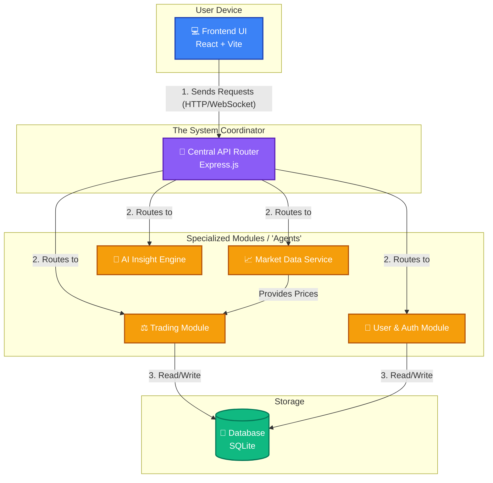
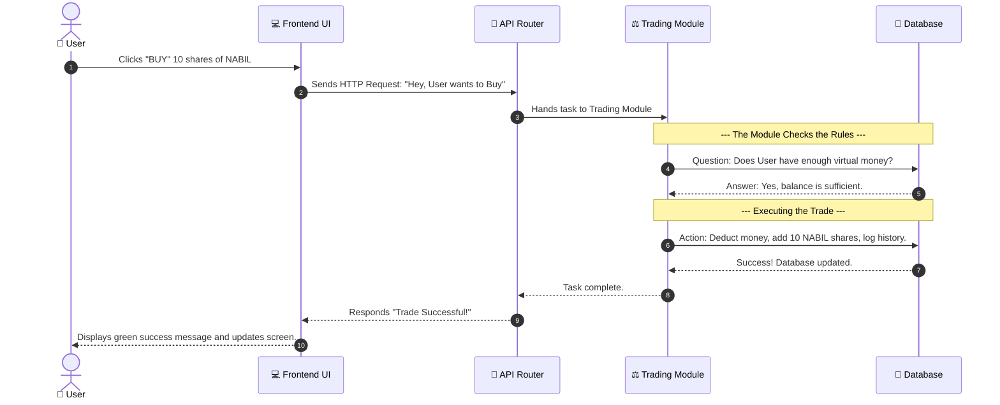

# DemoTrade: Beginner's Architecture Guide

Welcome to DemoTrade! If you are new to this project, this guide will walk you through how the system works under the hood. We will avoid complex jargon and use visual diagrams to explain how the different "moving parts" communicate with each other.

---

## 1. Project Overview

**What is DemoTrade?**  
DemoTrade is a simulated trading platform (paper trading) for the Nepal Stock Exchange (NEPSE). It allows users to:
*   Sign up and receive 100,000 virtual Rupees.
*   Browse real-time (simulated) stock prices for major NEPSE companies.
*   Buy and sell stocks without risking real money.
*   Get AI-driven insights on stock trends to help make informed decisions.
*   Track their portfolio value and trading history.

---

## 2. High-Level Architecture

While you might think of the system having "agents" that do the work, in modern web applications like this, we call them **Services** and **Controllers**. The "Agent Manager" in our project is the **Backend API Router** (built with Express.js). It acts as the central traffic cop, taking requests from the user and handing them off to the right specialized module to do the work.

Here is a visual map of the entire system:

---

## 3. The Specialized Modules (Our "Agents")

Think of the backend as a company. The **API Router** is the front desk receptionist, and it passes tasks to specific departments:

*   **📈 Market Data Service:** This module's only job is to constantly generate realistic stock prices and push them to the frontend so the numbers on the screen are always moving.
*   **⚖️ Trading Module:** When you click "Buy" or "Sell", this module checks if you have enough virtual money, calculates the total cost, and updates your holdings.
*   **🔐 User & Auth Module:** This handles security. It logs people in, registers new accounts, and ensures nobody can access your portfolio but you.
*   **🤖 AI Insight Engine:** This module looks at a stock's recent price changes and generates a "Bullish" or "Bearish" analysis to help users decide what to do.

---

## 4. Step-by-Step Workflow: Processing a Trade

What actually happens when you click the "BUY" button? Let's break it down into a simple, visual workflow. 

### Explanation of the Steps:
1.  **Action:** You tell the Frontend what you want to do.
2.  **Request:** The Frontend wraps your instruction into a package (an HTTP request) and sends it across the internet to the Backend API Router.
3.  **Routing:** The API Router sees that this is a "Trade" request, so it wakes up the Trading Module.
4.  **Verification:** The Trading Module checks the Database to make sure you aren't trying to spend virtual money you don't have.
5.  **Execution:** If everything is okay, it updates the Database (your balance goes down, your shares go up).
6.  **Response:** The Trading Module tells the Router it finished, the Router tells the Frontend, and the Frontend updates your screen so you can see your new stocks!

---

## Summary

In short, DemoTrade relies on a **central coordinator (API Router)** that takes your clicks from the **Frontend**, figures out what module needs to handle it, and passes the job to specialized **Services** (like the Trading or Market data modules). These services do the math, update the **Database**, and send the results back to your screen instantly!
