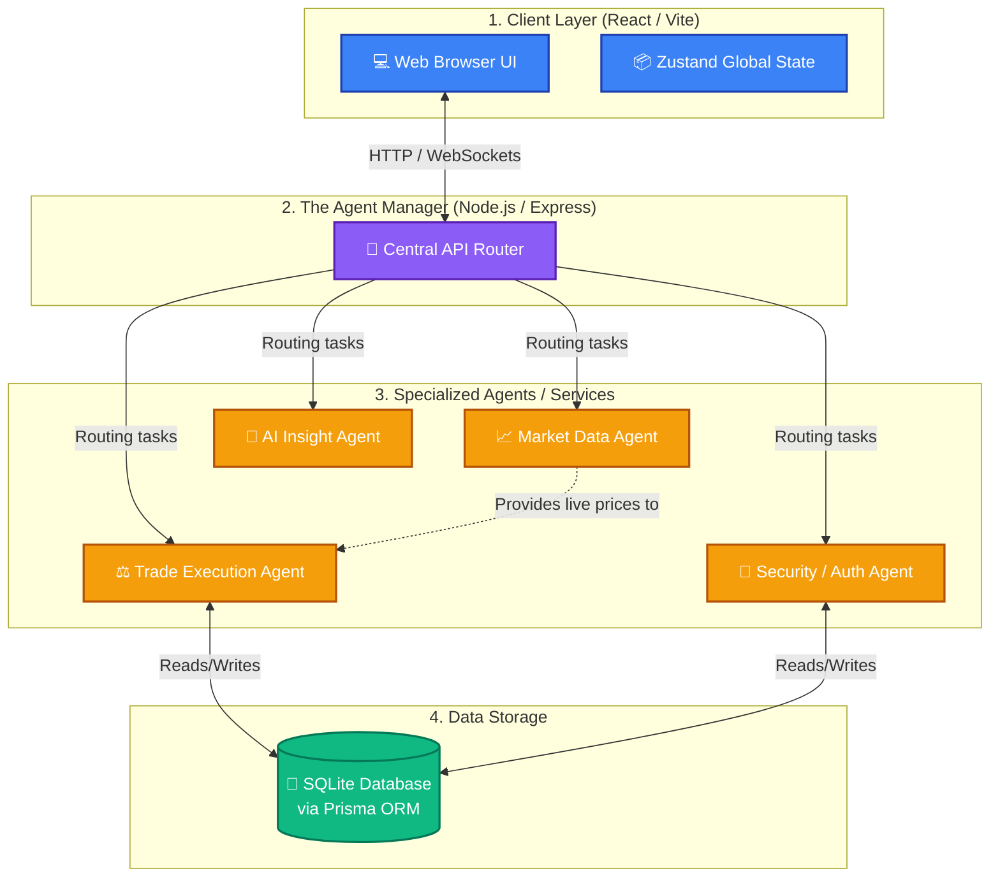
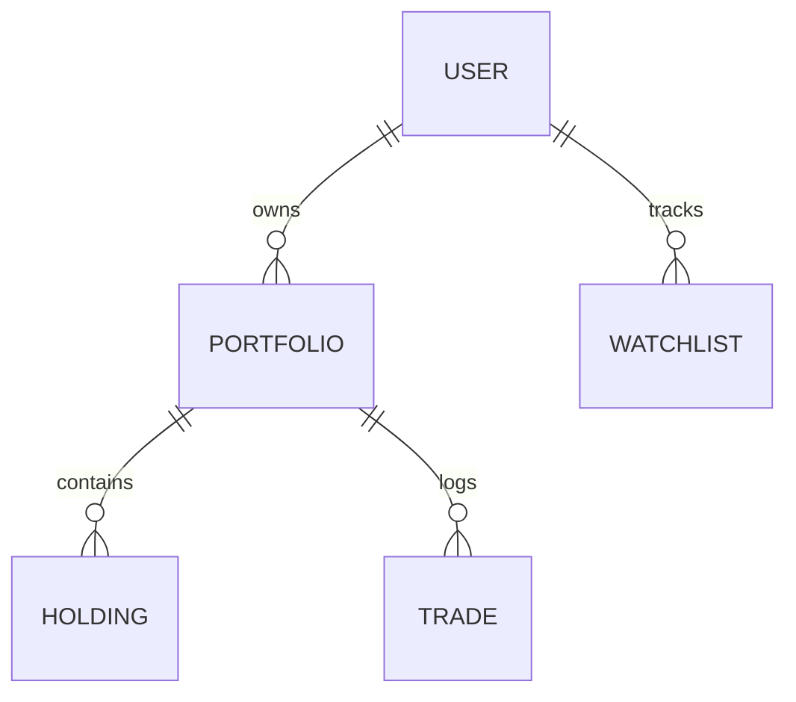
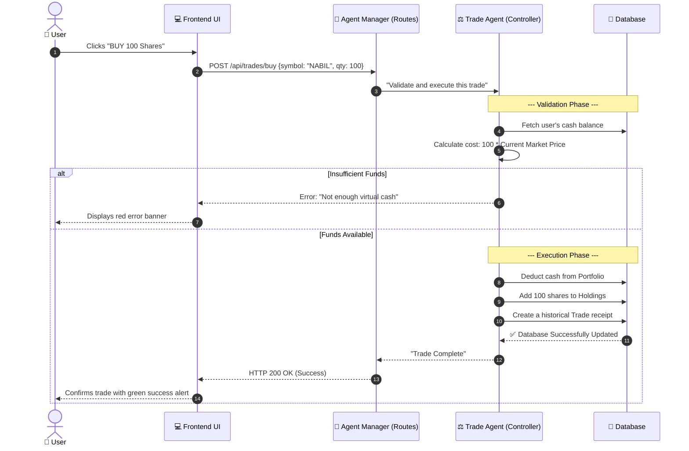

# DemoTrade: Complete System Architecture & Project Documentation

Welcome to the complete, beginner-friendly documentation for the **DemoTrade** project! Whether you are a new developer joining the team or just someone trying to understand how a full-stack trading application works, this guide will walk you through the entire system.

We will avoid complex technical jargon and heavily rely on visual diagrams to explain how the system's "Agent Manager" coordinates tasks between the frontend, the backend, the database, and the specialized modules.

---

## 1. Project Purpose & Main Features

### What is DemoTrade?
DemoTrade is a **paper trading simulator** built specifically for the Nepal Stock Exchange (NEPSE). It allows users to practice stock trading with virtual money in a risk-free environment. The system generates realistic, real-time market data so users can learn how the market moves without risking actual capital.

### Main Features Implemented
1. **Real-Time Market Data Display:** A live-streaming dashboard that shows 30+ simulated NEPSE stocks with their current prices, daily changes, and trading volumes.
2. **Simulated Trading Engine:** A core module that allows users to place "BUY" and "SELL" orders, deducting virtual funds and securely logging trading history.
3. **Portfolio Management:** A personalized dashboard that tracks a user's total net worth, available cash balance, and current stock holdings.
4. **Watchlists:** A system allowing users to "star" or bookmark specific stocks to track them easily.
5. **AI Analytics & Insights:** An automated module that acts as a "Market Analyst," analyzing recent price charts to provide users with "Bullish" or "Bearish" sentiment indicators and actionable advice.

---

## 2. The Full System Architecture: The "Agent Manager" Concept

When building a modern web application, organizing the code is critical. DemoTrade relies on a concept similar to an **"Agent Manager"**. Instead of having one massive file that does everything, the system is broken down into a **Coordinator** (the API Router) and several specialized **Agents** (the Services/Controllers).

### The Three Main Layers:
1. **The Client (Frontend):** Built with React, Vite, and Tailwind CSS. This is what the user sees and interacts with on their browser.
2. **The Agent Manager (Backend API):** Built with Node.js and Express. It receives requests from the Frontend, decides *which* specialized agent needs to handle the task, and routes the traffic.
3. **The Database (Storage):** Powered by SQLite and Prisma ORM. This is where user accounts, balances, and trade histories are securely stored.

### High-Level System Architecture Diagram

---

## 3. Project Folder Structure & Key Files

The codebase is split into two massive folders: `frontend` and `backend`.

### Frontend Structure
*   **`src/pages/`**: The visual screens (e.g., `Dashboard.tsx`, `Market.tsx`, `Login.tsx`).
*   **`src/components/`**: Reusable UI blocks like the `Navbar`.
*   **`src/store/`**: Using a tool called Zustand, this is the frontend's short-term memory. It remembers if the user is logged in (`useAuthStore.ts`) and caches the live stock prices (`useMarketStore.ts`).
*   **`src/api/axios.ts`**: The bridge file. Every time the frontend wants to talk to the Backend Agent Manager, it uses this file.

### Backend Structure
*   **`src/routes/`**: **The Agent Manager.** These files map URLs (like `/api/auth/login`) to the correct specialized agent.
*   **`src/controllers/`**: **The Agents.** This is where the business logic lives. For example, `trade.controller.ts` contains the exact math for buying a stock.
*   **`src/market/`**: A sub-system dedicated purely to simulating realistic stock data and managing WebSocket connections (`Socket.io`) to stream prices to the frontend.
*   **`prisma/schema.prisma`**: The blueprint of the database.

---

## 4. The Database Models (The Blueprints)

To understand DemoTrade, you must understand the data it tracks. Here are the core models:

| Model Name | What it stores | Why it's important |
| :--- | :--- | :--- |
| **User** | Email, Hashed Password | Securely identifies the trader. |
| **Portfolio** | Available Cash Balance (NPR) | Linked directly to a User. Starts at 100,000. |
| **Holding** | Symbol (e.g., "NABIL"), Quantity | Keeps track of exactly which stocks the user owns in their Portfolio. |
| **Trade** | Type (Buy/Sell), Price, Timestamp | The ledger. A historical log of every action taken by the user. |
| **Watchlist** | User ID, Symbol | Stores the user's favorite stocks for quick tracking. |

---

## 5. Main Workflows: Step-by-step Interactions

Let's look at three major tasks the user can perform, and visualize how the system handles them.

### Workflow A: Loading the Dashboard & Live Market Data
When the user successfully logs in and views their dashboard, a complex but incredibly fast workflow occurs behind the scenes.

1.  **Frontend Request:** The UI asks the Agent Manager for the user's Portfolio.
2.  **Database Query:** The Auth Agent verifies the user's cookies, and fetches their Portfolio and Holdings from the SQLite Database.
3.  **WebSocket Connection:** Simultaneously, the Frontend connects via `Socket.io` to the Market Data Agent.
4.  **Live Polling:** The Market Data Agent continuously generates new mock stock prices every 5 seconds and pushes them directly into the Frontend's UI without requiring manual page reloads.

### Workflow B: Placing a Trade (Component Interaction Diagram)
This is the most critical process in DemoTrade. If a user tries to buy 100 shares of NABIL Bank:

### Workflow C: Generating AI Insights
When a user clicks on a distinct stock to view its detail page, they see AI-driven advice. Here's how it is generated:

1.  **Request:** The Frontend hits `/api/market/stocks/NABIL/ai-insight`.
2.  **AI Agent Activation:** The Agent Manager routes this request to the `AIAgent`.
3.  **Analysis Logic:** The AI Agent looks at the stock's current price, its daily percentage change, and its virtual volatility score.
4.  **Sentiment Output:** 
    *   If the price is rapidly increasing (high volatility + positive change), the AI Agent flags it as **BULLISH** and generates text: *"DemoTrade AI detects strong bullish momentum... proceed with trailing stops."*
    *   If it's dropping quickly, it flags it as **BEARISH**.
5.  **Response:** The insight is bundled with a simulated Confidence Score (e.g., 88%) and sent back to the user's screen instantly.

---

## 6. Summary of the Architecture's Brilliance

The reason this project is robust is because of **Separation of Concerns**. 
*   If the Market Data API crashes, the Trading Engine still functions. 
*   Because we use Prisma ORM, swapping SQLite for a massive production database like PostgreSQL takes less than 3 lines of code changes. 
*   Because the Frontend uses Zustand, the app remembers the latest stock prices instantly as you switch between the Dashboard and the Trade History pages, resulting in a zero-lag user experience.

DemoTrade acts exactly like a team of specialized bots managed by a highly efficient coordinator desk, perfectly orchestrated to deliver a seamless paper-trading experience.
